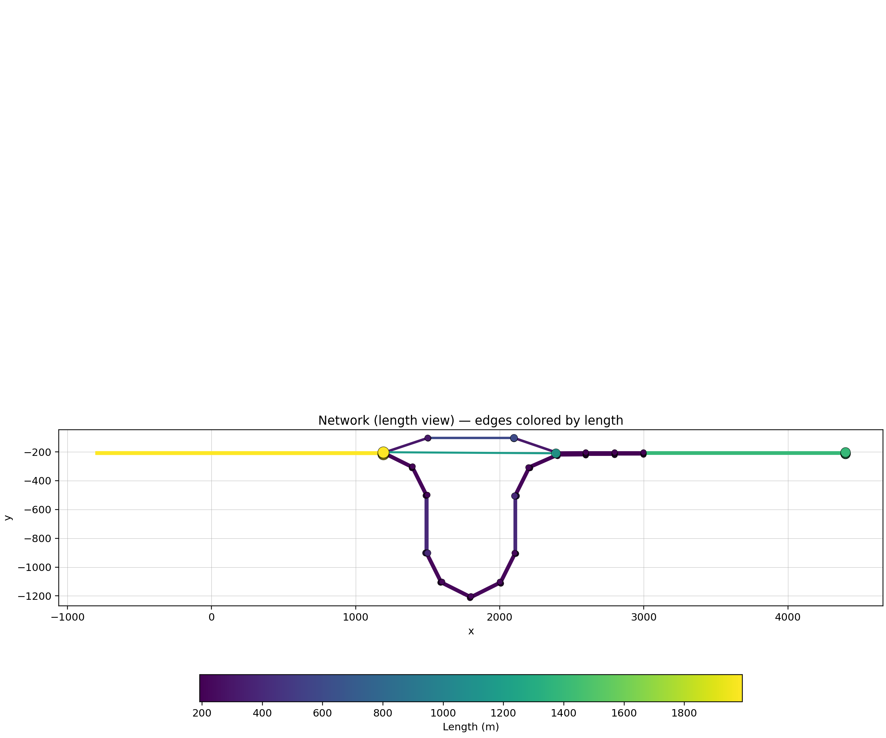
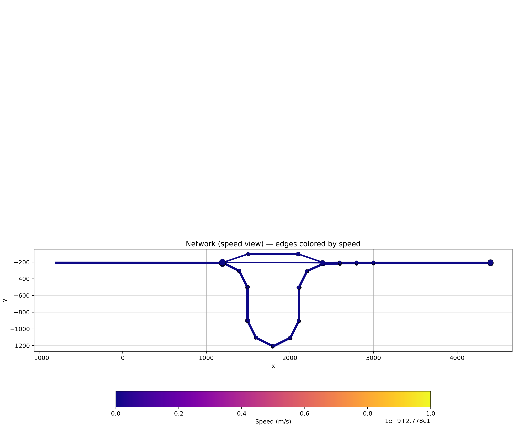
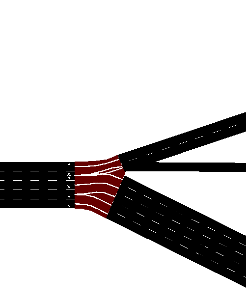
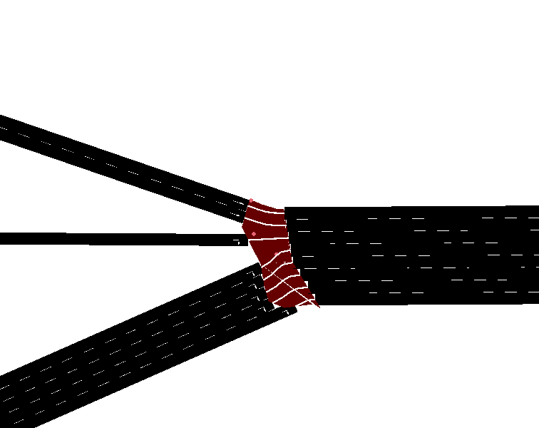

# Network & Analysis

## Contents

This folder contains both the SUMO network configuration files and the analysis scripts used to evaluate simulation runs.


```
./
├── analysis_script/
│   └── ...
├── network_base/ # contains the sumo network files
│   └── ...
├── runs_out/
    └── ...
```

### Analysis scripts

`run_sumo_simulation.py` runs a series of SUMO simulations where different numbers of vehicles travel along different routes (`route0`, `route1`, and `route2`). The resulting output files, including `summary.xml`, `tripinfo.xml`, and `routes.xml`, are automatically saved in the `runs_out` directory.

`visualise_network.py` generates visualizations of the SUMO network, showing the **speed limits** and **edge lengths** for each segment. These plots provide an overview of the network’s structure and properties.






`plot_mean_travel_times_per_step.py` reads the simulation results stored in the `runs_out` folder and plots the **mean travel time per timestep** for each run using data from the corresponding `summary.xml` files. 


### Runs out

This directory contains subfolders for each experiment. Each subfolder is named using the format:  
`veh{number_of_vehicles}_route{route_id}`

where:  
- `{number_of_vehicles}` indicates the number of vehicles used in the simulation.  
- `{route_id}` is either `0`, `1`, or `2`, representing the selected route configuration.

Each experiment folder includes all simulation output files except the network file. The files **`summary.xml`** and **`tripinfo.xml`** are used for generating the plots and analyzing the results.


## Network

#### Network overview


#### Junction 1



#### Junction 15

